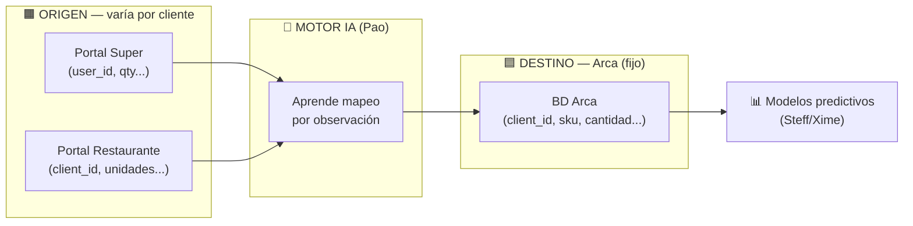
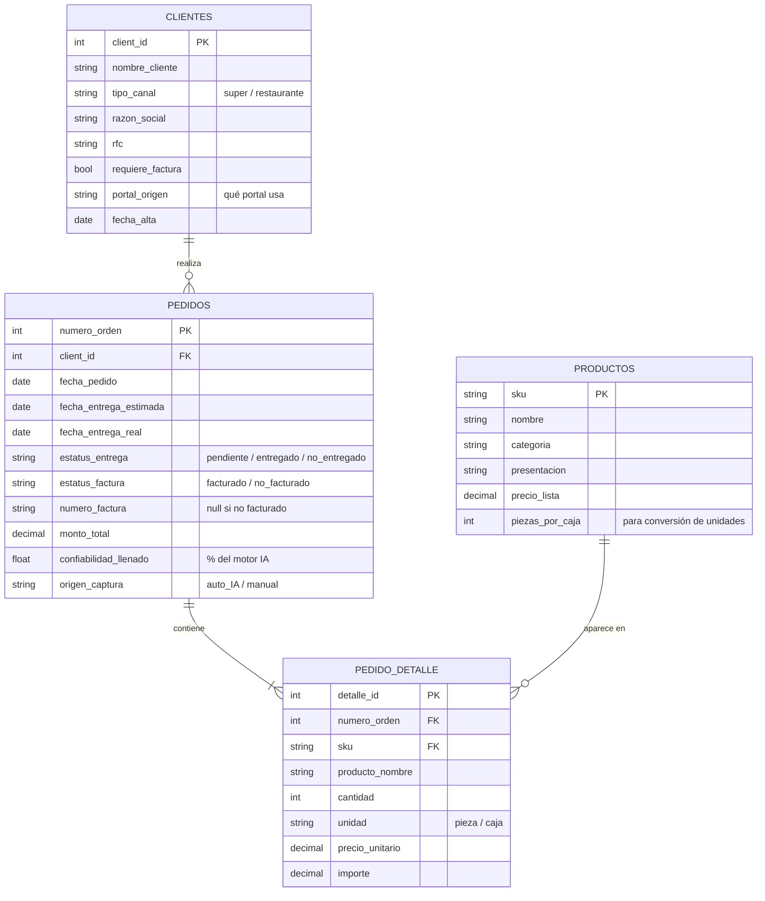
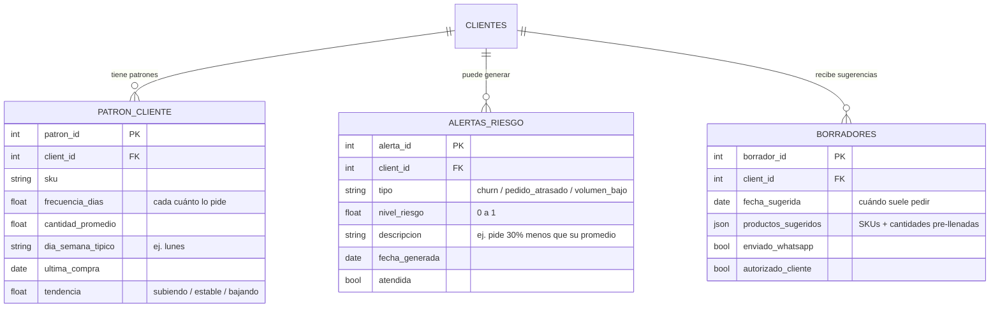
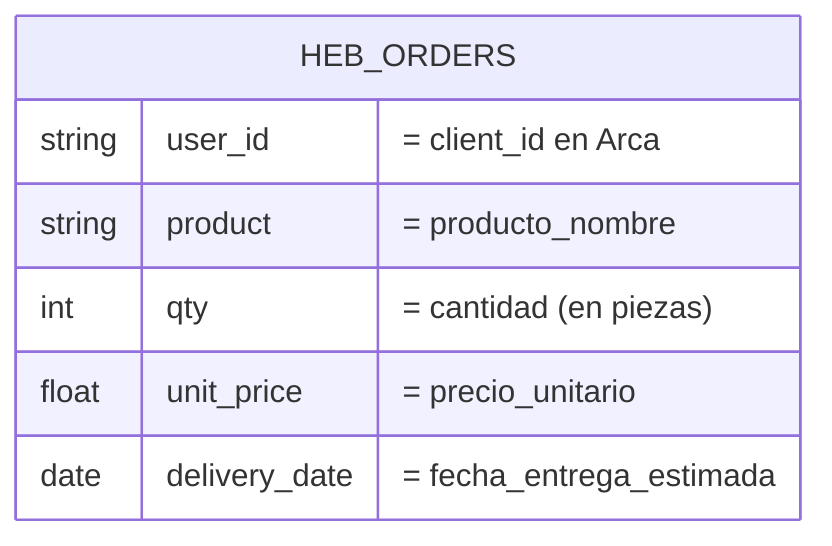
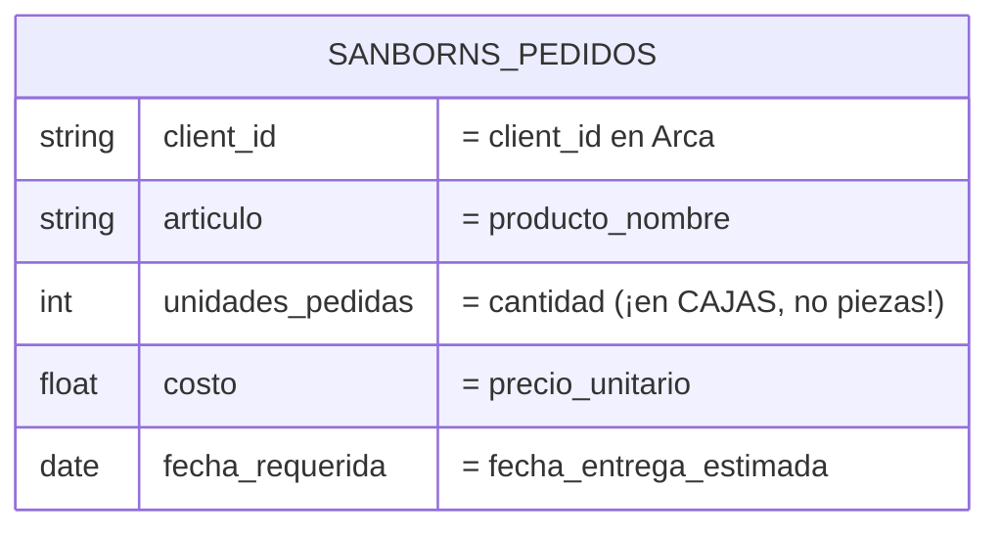

# Esquema de Bases de Datos — "Always on Shelf"
### Equipo: Fer · Xime · Steff · Pao

---

## Concepto clave: hay DOS mundos de datos

Esto es lo más importante de entender antes de diseñar nada:

| Mundo | Quién | Estructura | Nombres de campo |
|---|---|---|---|
| **ORIGEN (clientes)** | Portal de cada cliente (super, restaurante) | DISTINTA por cliente | DISTINTOS (`user_id`, `producto`, `qty`...) |
| **DESTINO (Arca)** | Sistema interno de Arca | FIJA, una sola | FIJOS (`client_id`, `sku`, `cantidad`...) |

El LLM debe **aprender que `user_id` (super) = `client_id` (restaurante) = `client_id` (Arca)** — sin que se lo digamos campo a campo. Por eso simulamos varias bases de cliente con nombres distintos a propósito.

---

# PARTE 1 — Base de datos de ARCA (destino fijo)

Es el sistema interno donde todo se registra y de donde salen los datos para los modelos predictivos. Tiene 4 tablas principales.

### Por qué cada campo importa para lo que pediste

| Necesidad que mencionaste | Campos que la resuelven |
|---|---|
| Control de entregados / no entregados | `PEDIDOS.estatus_entrega`, `fecha_entrega_real` |
| Control de facturados + número de factura | `PEDIDOS.estatus_factura`, `numero_factura` |
| Número de orden | `PEDIDOS.numero_orden` (PK) |
| % de confiabilidad del llenado (Steff) | `PEDIDOS.confiabilidad_llenado` |
| Saber qué llenó el bot vs un humano | `PEDIDOS.origen_captura` |
| Productos por pedido | tabla `PEDIDO_DETALLE` completa |
| Conversión de unidades (caja↔pieza) | `PRODUCTOS.piezas_por_caja` |

---

# PARTE 2 — Tablas para los modelos predictivos

Estas **se derivan** de los pedidos históricos de Arca (Parte 1). No son datos crudos nuevos: son agregaciones que alimentan a Steff/Xime. Idealmente se recalculan cada que entra un pedido nuevo.

### Cómo cada tabla alimenta lo que pediste

- **`PATRON_CLIENTE`** → es el cerebro del autocompletado y los borradores. "Este cliente pide SKU-X cada 7 días, los lunes, ~50 piezas." De aquí salen los formatos pre-hechos.
- **`ALERTAS_RIESGO`** → es lo que Arca ve en el dashboard. El modelo de churn escribe aquí: "cliente pidiendo menos → en riesgo." `nivel_riesgo` y `tipo` manejan los warnings.
- **`BORRADORES`** → los pedidos pre-hechos que se mandan por WhatsApp. `productos_sugeridos` es el JSON listo para que el cliente solo autorice.

> 💡 **Para el equipo de datos:** estas tres tablas son *features tables*. El modelo de churn entrena con la serie histórica de `PEDIDOS` + `PEDIDO_DETALLE` agrupada por `client_id` en el tiempo, y escribe sus salidas en `ALERTAS_RIESGO`. El de autocompletado lee `PATRON_CLIENTE`.

---

# PARTE 3 — Simulación de las bases de datos de CLIENTE (origen)

Aquí está el punto pedagógico del reto: **cada cliente nombra sus campos distinto.** Simulamos al menos dos, deliberadamente diferentes, para que el LLM demuestre que entiende el significado, no la posición.

### Cliente A — HEB (super)
Estructura tipo tabla, en inglés/abreviado:

### Cliente B — Sanborns (tienda/cafetería)
Estructura distinta, en español, con otros nombres y otras unidades:

### La tabla de equivalencias que el LLM debe APRENDER (no la hardcodeamos)

| Concepto real | HEB (A) | Sanborns (B) | Arca (destino) |
|---|---|---|---|
| Identificador de cliente | `user_id` | `client_id` | `client_id` |
| Producto | `product` | `articulo` | `producto_nombre` |
| Cantidad | `qty` (piezas) | `unidades_pedidas` (cajas) | `cantidad` (piezas) |
| Precio | `unit_price` | `costo` | `precio_unitario` |
| Fecha entrega | `delivery_date` | `fecha_requerida` | `fecha_entrega_estimada` |

> 🎯 **Esta tabla es la prueba de oro del demo.** El bot observa UNA vez, infiere estas equivalencias, y el jurado puede verificar que `user_id` → `client_id` lo dedujo, no lo tenía escrito. El caso de las **cajas vs piezas** en el restaurante es el más vistoso: requiere que el bot use `PRODUCTOS.piezas_por_caja` para convertir — eso es razonamiento, no copia.

---

# PARTE 4 — Notas de implementación para el equipo

- **Una sola BD física, varios esquemas lógicos.** Para el hackathon, lo más simple: una base (SQLite o Postgres) con las tablas de Arca + predictivas, y los "portales cliente" sirviendo sus datos desde tablas/JSON separados que simulan ser sistemas externos.
- **El `client_id` es la llave de todo el predictivo.** Es lo que une el historial, los patrones, las alertas y los borradores. Si el bot mapea mal el identificador de cliente, todo lo demás se cae — por eso es el campo más importante a probar.
- **Historial simulado:** generar ~8-12 semanas de pedidos por cliente (3-4 por semana, como dijo Arca) para que los modelos tengan con qué entrenar. Incluir a propósito un cliente cuyo volumen baja con el tiempo (ej. Sanborns pidiendo menos) → para que el modelo de churn tenga algo que detectar en el demo.
- **Transparencia:** marcar en el dashboard que el historial es simulado. Con jurado de data scientists, eso suma.

---

*Documento de Fase 0 — base para que las cuatro construyan sobre el mismo esquema.*
